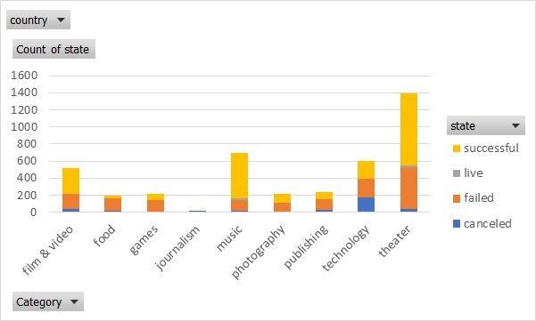
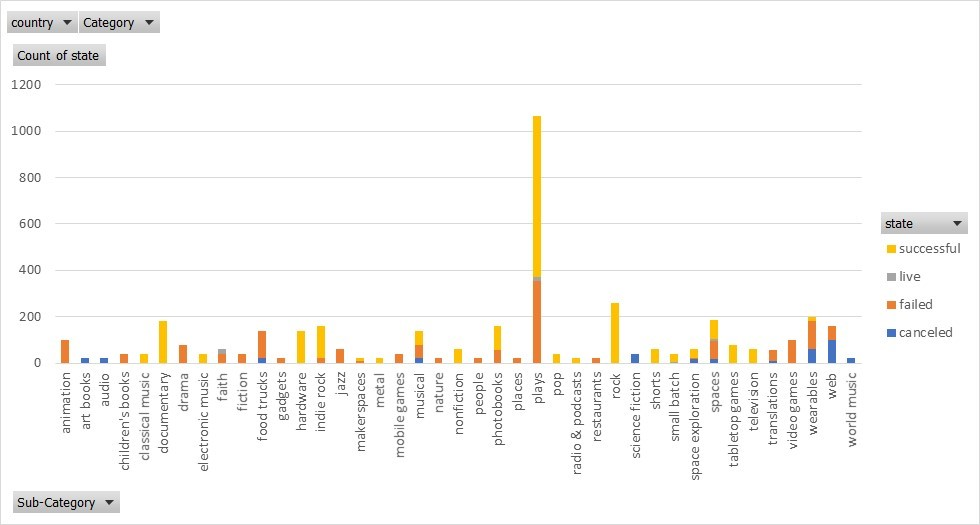
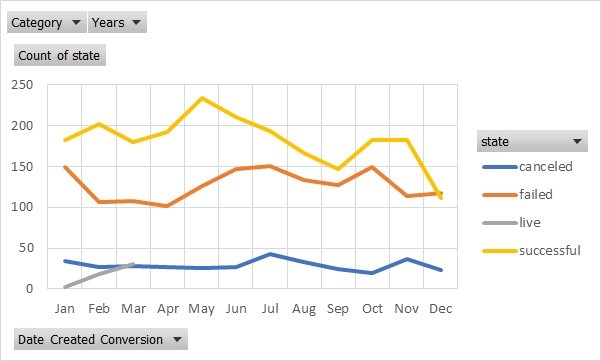

# Kickstarter Analysis

Project analyzing the characteristics from a subset of kickstarter projects between 2009 and 2017.

Analysis done using Excel's PivotTable, PivotChart, functions, and conditional formatting

##### Projects by Category and Status

##### Projects by Subcategory and Status

##### Project Statuses Over Time

#### Conclusions
- The top 4 categories with the highest # of projects were:
	- Theatre
	- Music
	- Technology
	- Film & Video
- Although technology category was in the top 4 # of projects initiated. It didn’t have a high rate of success (34.8% of initiated projects were successful)
- The music category had the highest percentage of success with 77%

#### Limitations
- Source data given as part of class homework
- Limited date range
- Unsure if it is a representative sample

#### Future graph ideas
- 100% Stacked column chart to show the percentage of the state by category and by subcategory
- Stacked column chart of state by country
- Line graph of state by time (month and year)

